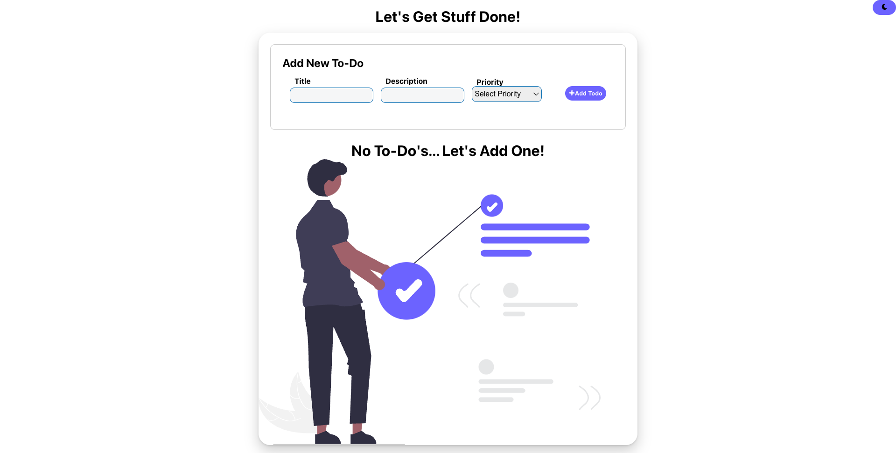
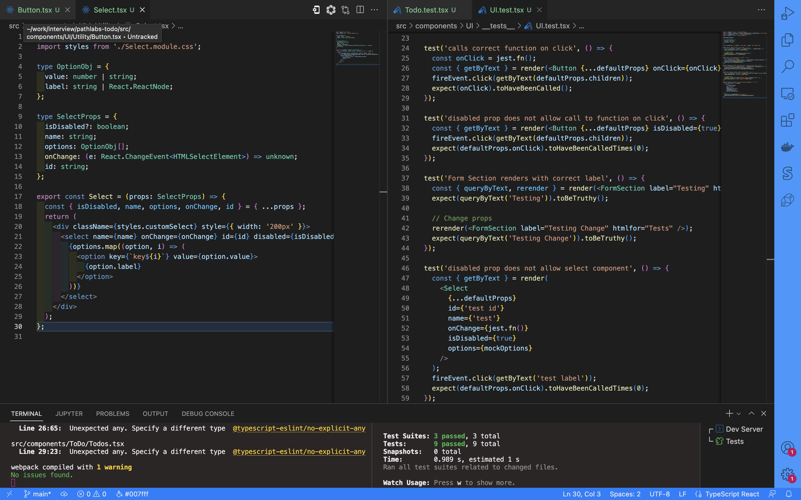

</img>

# Pathlabs - TypeScript To-Do App

## Prompt

```
- Build a front-end application showing a working to-do app
    - This doesn't need any backend or data persistence. Use a datastore on the front-end (eg, redux, or localstorage)
    - it should show how a simple to-do app could work
eg. SPA where I can add, edit update, complete and delete a to-do list
```

## Setup

### First, install dependencies:

```bash
npm install
# or
yarn install
```

### Next run the dev server

```bash
npm start
```

### View The App

- http://localhost:3000  
  </img>

### Run Tests

```bash
npm run test
```

## Initial Thoughts

## Process

- I started by creating a react typescript app with CRA and setting up setting up the dev environment with eslint and prettier. We can update eslint to include some rules for jest testing and for not requiring React to be in scope. Unnecessary since React 17.

- Next, using TDD strategies, created typings for a todo object and context. Context includes an array of todos to share across the application as well as functions to add, update, delete and complete a task from the context provider and a loading state so we can mock some asynchronous logic across our app.  
  </img>

- Then with our context in place we start mocking todo data so we can create a todo component to display it appropriately. Then a "Todos" component which will display our state of todos of which there are two possiblities:  
    1. The context is empty and a zero state image is shown
    2. We map out our array of todos and display the previously completed todo 
    component for each item in the array.   
    3. Next create form components for adding and editing a todo, we used uncontrolled components. Deciding this over controlled inputs since our UI feedback necessity is minimal and we have so few inputs needed.  
- Next thought about how a general todo list could be extended with categories and priorities, and decided to add priority tags to our todo. 
- Finally worked on styling and theming to create a UI that was cohesive, easily understandable and functional.

## What I am proud of

- No CSS library used - In the past, I have worked extensively with Tailwind, ChakraUI and Bootstrap. As well as writing SCSS, so deciding to write my own css was a fun challenge.
- 

## What I learned

- Only with controlled form elements can we instantly validate the value.
- How to mock and test contextual components with Jest

## If I took more time

- We would also like the table to be able to sort by status, our sort function currently only takes in parameters type number or enum.
- Allow the theme colors defined in config to be consumed by our theme context 
- 

## What I would do differently / Trade-offs

- Controlled vs Uncontrolled form elements. Using controlled inputs would allow us to instantly validate form inputs with an onBlur() and potentially create some dynamic fields (tags maybe?). On the other hand our uncontrolled inputs were quicker to create and with the relative simplicity of necessary UI feedback and minimal inputs this works just fine.
- Creating more modular css files. I wrote most of the css for the app in a single file for simplicity sake. Although, best practices would be introducing modularity so we are only applying necessary classes and not needing to write workarounds for specific elements. We could keep the base css like theming and resets in our styles.css and use this as our global classes and create modular css files for our components.
